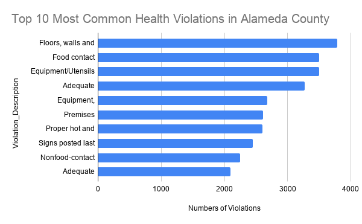

# Albany Leads Alameda County in Yellow-Rated Restaurant Inspections

## Data Source

This dataset comes from the **Alameda County Department of Environmental 
Health (DEH)**, published on the Alameda County Open Data Hub. It contains 
48,562 inspection records for food facilities across the county, including 
restaurants, markets, food trucks, school cafeterias, and other food 
service operations.

**Dataset link:** https://data.acgov.org/datasets/e95ff2829e9d4ea0b3d8266aac37ff14

The DEH is a government agency responsible for enforcing California's 
Retail Food Code (CalCode), which makes it an authoritative and 
trustworthy source. However, several limitations apply:

- The City of Berkeley operates its own independent inspection program 
  and is largely excluded from this dataset
- The data was last updated in **April 2020**, and does not reflect 
  post-COVID changes in the restaurant industry
- Inspection frequency may vary by facility type and available staffing 
  resources, which could affect how often violations are recorded

---

## Key Questions

1. Which cities in Alameda County have the highest rate of 
   Yellow-rated (conditional pass) inspections?
2. What are the most common health violations cited across 
   all food facilities in the county?

---

## Data Analysis

The dataset was imported into Google Sheets for cleaning and analysis. 
Records with blank Grade fields were excluded. Two pivot tables were 
created to explore the data.

**Google Sheet link:** https://docs.google.com/spreadsheets/d/1QQ6GqNDnqU-ucs5cFPjjIu28daZHcJ_iTN7qoz7rBls/edit?gid=1484213677#gid=1484213677

### Finding 1: Albany has the highest Yellow inspection rate

Among cities with more than 500 inspection records, Albany had the 
highest share of Yellow-rated inspections at 26%, more than four times 
the rate of Dublin (6%). Yellow ratings indicate that a facility passed 
with conditions — violations were found but were not severe enough to 
require closure. Emeryville (23%) and Newark (21%) followed closely 
behind Albany.

### Finding 2: Physical facility conditions are the most cited violations

The most frequently cited violations county-wide were related to floors, 
walls, and ceilings (3,782 citations), followed by food contact surface 
sanitation (3,500) and equipment/utensil conditions (3,496). Inadequate 
handwashing facilities ranked fourth with 3,265 citations. These 
findings suggest that physical upkeep and sanitation practices are the 
most persistent challenges for food facilities in Alameda County.

---

## Visualizations

### Chart 1: Yellow-Rated Inspection Rate by City in Alameda County

Among cities in Alameda County with more than 500 inspection records, 
Albany had the highest share of Yellow-rated inspections at 26%, more 
than four times the rate of Dublin (6%). Yellow ratings indicate a 
facility passed with conditions, meaning violations were found but not 
severe enough to require closure.

*Source: Alameda County Department of Environmental Health 
Restaurant Inspections Dataset, 2020.*

---

### Chart 2: Top 10 Most Common Health Violations in Alameda County Restaurants

The most frequently cited violation was related to floors, walls, and 
ceilings, followed closely by food contact surface sanitation and 
handwashing facilities. Together, the top 10 violations account for 
the majority of all inspection findings across the county.

*Source: Alameda County Department of Environmental Health 
Restaurant Inspections Dataset, 2020.*

---

## Methods and Limitations

- Only records with a non-null Grade field were included in the analysis
- Cities with fewer than 500 total inspection records were excluded 
  to avoid misleading conclusions from small sample sizes
- Berkeley is largely excluded from this dataset as it operates its 
  own inspection program
- The dataset was last updated April 2020 and does not reflect 
  current conditions
- A higher Yellow rate in one city may reflect more frequent 
  inspections or stricter enforcement standards, not necessarily 
  worse restaurant hygiene
- This dataset does not include neighborhood demographic or income 
  data, so no conclusions about environmental justice can be drawn 
  from this analysis alone

---

## Summary and Ethical Concerns

This analysis shows that health inspection outcomes vary significantly 
across Alameda County cities. Albany and Emeryville consistently showed 
higher rates of conditional-pass inspections, while Dublin had the 
lowest. The most common violations were related to physical facility 
conditions and sanitation practices.

However, several ethical concerns must be noted. Publishing 
city-level failure rates without deeper context could unfairly 
stigmatize certain communities, particularly cities with higher 
concentrations of small, immigrant-owned restaurants that may have 
fewer resources for facility upgrades. A higher violation rate does 
not automatically mean a restaurant is unsafe — many violations are 
minor and corrected immediately after inspection.

To make this a more complete and ethical story, additional reporting 
would be needed, including interviews with DEH inspectors about how 
priorities and inspection frequency are set, cross-referencing 
inspection outcomes with neighborhood income and demographic data to 
test for environmental justice concerns, and following up on 
re-inspection outcomes to determine whether violations were promptly 
corrected.
