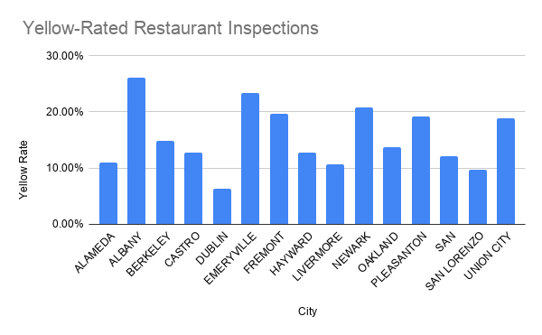

# Albany Leads Alameda County in Yellow-Rated Restaurant Inspections

## Data Source

This dataset comes from the **Alameda County Department of Environmental 
Health (DEH)**, published on the Alameda County Open Data Hub. It contains 
48,562 inspection records for food facilities across the county, including 
restaurants, markets, food trucks, school cafeterias, and other food 
service operations.

**Dataset link:** https://data.acgov.org/datasets/e95ff2829e9d4ea0b3d8266aac37ff14

The DEH is a government agency responsible for enforcing California's 
Retail Food Code (CalCode), which makes it an authoritative and 
trustworthy source. However, several limitations apply:

- The City of Berkeley operates its own independent inspection program 
  and is largely excluded from this dataset
- Inspection frequency may vary by facility type and available staffing 
  resources, which could affect how often violations are recorded

---

## Key Questions

1. Which cities in Alameda County have the highest rate of 
   Yellow-rated (conditional pass) inspections?
2. What are the most common health violations cited across 
   all food facilities in the county?

---

## Data Analysis

Import the dataset into Google Sheets for cleaning and analysis firstly. Screen out and eliminate useless or blank records, and explore and interpret the connections between the data based on the two created PivotTable tables.

**Google Sheet link:** https://docs.google.com/spreadsheets/d/1QQ6GqNDnqU-ucs5cFPjjIu28daZHcJ_iTN7qoz7rBls/edit?gid=1484213677#gid=1484213677

### Finding 1: Albany has the highest Yellow inspection rate

Among cities with more than 500 inspection records, Albany had the 
highest Yellow-rated inspection rate at 26%, followed by Emeryville 
at 23% and Newark at 21%. Dublin had the lowest rate at just 6%. 
The gap between Albany and Dublin is striking — Albany restaurants 
received conditional-pass ratings at more than four times the rate 
of Dublin.

### Finding 2: Physical facility conditions are the most cited violations

The top four violations all relate to physical upkeep and basic 
sanitation: floors, walls and ceilings (3,782), food contact surface 
cleanliness (3,500), equipment and utensil conditions (3,496), and 
handwashing facilities (3,265). Notably, these are not food-handling 
errors — they are structural and maintenance issues, suggesting that 
many facilities struggle with long-term upkeep rather than day-to-day 
food preparation practices.

---

## Visualizations

### Chart 1: Yellow-Rated Inspection Rate by City in Alameda County

Among cities in Alameda County with more than 500 inspection records, 
Albany had the highest share of Yellow-rated inspections at 26%, more 
than four times the rate of Dublin (6%). Yellow ratings indicate a 
facility passed with conditions, meaning violations were found but not 
severe enough to require closure.

*Source: Alameda County Department of Environmental Health 
Restaurant Inspections Dataset, 2020.*

---

### Chart 2: Top 10 Most Common Health Violations in Alameda County Restaurants

The most frequently cited violation was related to floors, walls, and ceilings, 
followed closely by food contact surface sanitation and handwashing facilities. 
These findings suggest that physical upkeep and sanitation practices are the most 
persistent challenges for food facilities in Alameda County.

*Source: Alameda County Department of Environmental Health 
Restaurant Inspections Dataset, 2020.*

---

## Methods and Limitations

- Cities with fewer than 500 total inspection records were excluded 
  to avoid misleading conclusions from small sample sizes
- Berkeley is largely excluded from this dataset as it operates its 
  own inspection program
- The dataset was last updated April 2020 and does not reflect 
  current conditions
- A higher Yellow rate in one city may reflect more frequent 
  inspections or stricter enforcement standards, not necessarily 
  worse restaurant hygiene
- This dataset does not include neighborhood demographic or income 
  data, so no conclusions about environmental justice can be drawn 
  from this analysis alone

---

## Summary and Ethical Concerns

This analysis indicates that in the cities of Alameda County, the results of 
health inspections and the points of non-compliance vary from city to city. 
Albany and Emeryville consistently showed higher rates of conditional-pass inspections, 
while Dublin had the lowest. The most common violations and physical facilities
Conditions and hygiene habits are related.

However, in critical thinking. Firstly, this research did not conduct a more 
in-depth background check, and the failure rate in cities might be unfair or even 
stigmatize certain communities. In addition, small restaurants run by immigrants 
lack funds for facility upgrades. A relatively high rate of violations does not 
necessarily mean that the food produced by restaurants is unsafe. 
Many violations are minor issues and are immediately rectified after inspection.

To make this story more complete and ethical, it is necessary to interview 
DEH inspectors and system rule-makers, asking them how they determine the 
priority and frequency of inspections, cross-compare the inspection results 
with community income and demographic data to verify whether there are 
environmental justice issues, and follow up on the re-examination results 
to confirm whether violations have been rectified in a timely manner.
